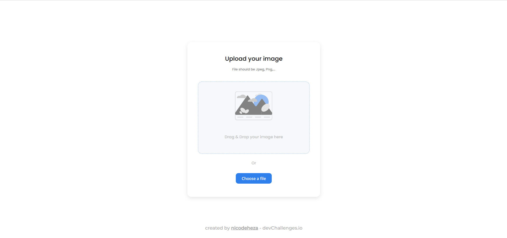

<!-- Please update value in the {}  -->

<h1 align="center">Image Uploader</h1>

<div align="center">
   Solution for a challenge from  <a href="http://devchallenges.io" target="_blank">Devchallenges.io</a>.
</div>

<div align="center">
  <h3>
    <!-- <a href="https://{your-demo-link.your-domain}">
      Demo
    </a>
    <span> | </span>
    <a href="https://{your-url-to-the-solution}">
      Solution
    </a>
    <span> | </span> -->
    <a href="https://devchallenges.io/challenges/O2iGT9yBd6xZBrOcVirx">
      Challenge
    </a>
  </h3>
</div>

<!-- TABLE OF CONTENTS -->

## Table of Contents

- [Overview](#overview)
  - [Built With](#built-with)
- [Features](#features)
- [How to use](#how-to-use)
- [Contact](#contact)
- [Acknowledgements](#acknowledgements)

<!-- OVERVIEW -->

## Overview


I built this project to practice TDD. I chose this challenge because it is short and simple and let me focus more on testing.

The project is a simple image uploader where you can drop or select an image from your system to save it to the server.

<!-- The project will be deployed on Heroku so if you test it the images that you upload are not going to persist. When the Heroku dynos shut down the images will be lost from the server disk. -->

<!-- The project is deployed on Heroku so if you test it  the images that you upload are not going to persist. When the Heroku dynos shut down the images will be lost from the server disk.  -->

### Built With

<!-- This section should list any major frameworks that you built your project using. Here are a few examples.-->

- [Next js](https://nextjs.org/)
- [Jest](https://jestjs.io/)
- [React Testing library](https://testing-library.com/docs/react-testing-library/intro/)
- [TypeScript](https://www.typescriptlang.org/)

## Features

<!-- List the features of your application or follow the template. Don't share the figma file here :) -->

This application/site was created as a submission to a [DevChallenges](https://devchallenges.io/challenges) challenge. The [challenge](https://devchallenges.io/challenges/O2iGT9yBd6xZBrOcVirx) was to build an application to complete the given user stories:

- **User story:** I can drag and drop an image to upload it
- **User story:** I can choose to select an image from my folder
- **User story:** I can see a loader when uploading
- **User story:** When the image is uploaded, I can see the image and copy it
- **User story:** I can choose to copy to the clipboard

## How To Use

<!-- Example: -->

To clone and run this application, you'll need [Git](https://git-scm.com) and [Node.js](https://nodejs.org/en/download/) (which comes with [npm](http://npmjs.com)) installed on your computer. From your command line:

```bash
# Clone this repository
$ git clone https://github.com/your-user-name/your-project-name

# Install dependencies
$ npm install

# Run the app in dev mode
$ npm run dev

# Run Tests
$ npm run test
```

## Acknowledgements

<!-- This section should list any articles or add-ons/plugins that helps you to complete the project. This is optional but it will help you in the future. For example -->

I want to mention some of the modules I used to build this project and thanks all thiers maintainers for their work.

- [Multer](https://github.com/expressjs/multer)
- [Next Connect](https://github.com/hoangvvo/next-connect)
- [uuid](https://github.com/uuidjs/uuid)

## Contact

- Website [nicolasdeheza.com](https://nicolasdeheza.com/)
- GitHub [nicodeheza](https://github.com/nicodeheza)
- LinkedIn [Nicolas Deheza](https://www.linkedin.com/in/nicolasdeheza/?locale=en_US)
